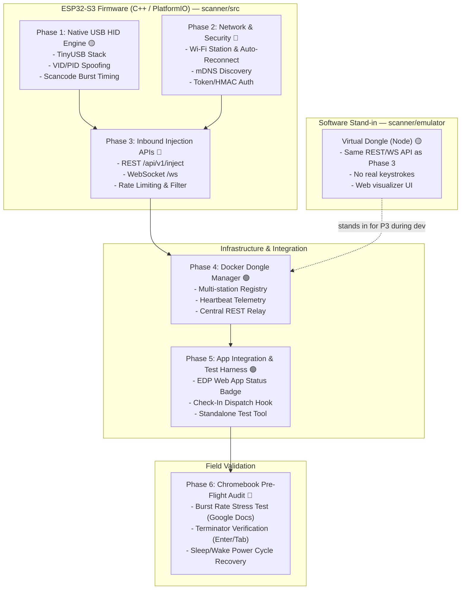

# ESP32-S3 USB Barcode Scanner Emulator — Implementation Plan

This implementation plan translates the technical specification in [docs/scanner-emulator.md](file:///Users/ball/Documents/Projects/Cajon-Valley-EDP-Attendance-App/docs/scanner-emulator.md) into six modular, independently testable phases. Each phase defines clear technical deliverables, verification steps, and exit criteria.

---

## Implementation Status (audited 2026-09-26 against `scanner/`, audit issues fixed the same day)

Development stopped partway through. Phase 1 firmware is written and **now compiles for all four targets**, and a **Docker software stand-in** was built for the Phase 3/4 network APIs. The corresponding **firmware** for Phases 2–3 was never written. Nothing has been run on real hardware yet, and nothing is wired into the attendance app.

Automated tests (all passing): `pio test -e native` (9), `test_timing_analysis.py` (9), `emulator` `npm test` (22), `manager` `npm test` (12). See `scanner/README.md` → *Automated Tests*.

| Phase | Status | Where it lives |
|---|---|---|
| **1** USB HID Core | 🟡 Builds cleanly; unverified on hardware | `scanner/platformio.ini`, `scanner/include/`, `scanner/src/`, `scanner/test/` |
| **2** Network & Security (firmware) | 🔴 Not started (only sanitizer + cooldown exist, from Phase 1) | — |
| **3** Injection APIs (firmware) | 🔴 Not started on ESP32 · 🟡 Simulated in Node | `scanner/emulator/server.js` |
| **4** Dongle Manager | 🟢 Done for emulators (relay, auth, healthchecks); untested with real dongles | `scanner/manager/server.js`, `scanner/docker-compose.yml` |
| **5** App Integration | 🟢 Done against emulators; not yet tried on real hardware / production HTTPS | `src/services/scannerDongleService.ts`, `src/components/DongleStatusPill.tsx`, `src/components/DongleTestModal.tsx`, `src/App.tsx` |
| **6** Chromebook Field Validation | 🔴 Not started | — |

### Recommended next steps
1. Flash Phase 1 and run the Phase 1 hardware checks.
2. Decide how production (HTTPS) devices reach the manager (see Phase 5 → Open issues).
3. Build the Phase 2/3 firmware so it matches the API the emulator already exposes (the emulator is the reference).

---

## Architecture & Dependency Map



---

## Phase 1: Native USB HID Keyboard Engine (Hardware Standalone)

> **Status: 🟡 Builds cleanly for all four targets (`espressif32 6.x` / arduino-esp32 2.0.x) — not yet tested on hardware.**

### Objective
Establish the core embedded USB stack so the ESP32-S3 enumerates as a recognized USB HID Keyboard / Barcode Scanner on any host machine (macOS/Windows/ChromeOS) and accurately types character sequences with burst timing.

### Tasks
1. ✅ **Tooling & Project Setup:**
   - `scanner/platformio.ini` targets `esp32-s3-devkitc-1`, `framework = arduino`, `espressif32 @ ^6.5.0`.
   - USB OTG flags set: `-D ARDUINO_USB_MODE=0`, `-D ARDUINO_USB_CDC_ON_BOOT=1`. The board JSONs pass `-DARDUINO_USB_MODE=1`, so `build_unflags` removes it (otherwise HID mode depended on flag order).
   - Shared settings live in `[esp32s3_base]` (each env `extends` it), so the `native` test env doesn't inherit the ESP32 platform.
   - *Added beyond plan:* a `seeed_xiao_esp32s3` environment (`BOARD_SEEED_XIAO=1`, status LED on GPIO 21).
2. ✅ **TinyUSB Descriptors & VID/PID Profiles** (`include/config.h` → `SCANNER_USB_VID`/`SCANNER_USB_PID`, selected by `SCANNER_PROFILE` build flag; one PlatformIO env per profile). They were renamed from `USB_VID`/`USB_PID`, which silently overrode the board variant's own macros.
   - Profile A (Generic, `esp32s3_generic`, default): `0x303A:0x8002`
   - Profile B (Honeywell Xenon 1900, `esp32s3_honeywell`): `0x0C2E:0x0BA1`
   - Profile C (Zebra DS2208, `esp32s3_zebra`): `0x05E0:0x1200`
   - Manufacturer, product name, and serial (`CVUSD-SCAN-0001`) are set per profile.
3. ✅ **Burst Keystroke Generator** (`src/keystroke_engine.cpp`):
   - Implemented as `injectKeystrokeBurst(const String& payload, SuffixTerminator terminator, uint16_t delayMs)` returning a `KeystrokeResult` (success, chars injected, elapsed ms, error). The name and signature differ from the plan's `executeKeystrokeBurst(...)`.
   - Uses `USBHIDKeyboard::press/release` with ASCII characters (the library maps them to HID scancodes).
   - Timing: 4 ms hold + configurable inter-char delay (default 8 ms), clamped to 2–50 ms.
   - Aborts if the USB host isn't mounted (`(bool)USB`, i.e. started && mounted). Sanitizes input, then enforces a 250 ms cooldown; these pieces of Phase 2 were pulled forward. The rules live in `include/payload_rules.h` (pure C++, unit tested).
4. ✅ **Hardware Test Trigger** (`src/main.cpp`): BOOT button (GPIO 0, 50 ms debounce) injects `TEST-10042` + Enter.
   - *Added beyond plan:* serial console at 115200 — `t` (test scan), `i:<id>` (custom ID), `s` (USB status), `h` (help).
   - *Added beyond plan:* `test/test_keystroke_timing.py`, a host-side burst timing analyzer.

### Fixed (2026-09-26)
- ✅ **It didn't compile:** `USB.ready()` doesn't exist in arduino-esp32 2.0.x (`'class ESPUSB' has no member named 'ready'`). It now uses `(bool)USB`. All four envs build without warnings, and the TinyUSB HID keyboard is confirmed linked in `firmware.elf`.
- ✅ **Timing harness `\r` bug:** Enter is now detected as `\r`, `\n`, or `\r\n`. The terminal stays in cbreak mode for the whole session instead of toggling raw mode per read, which also means Ctrl+C now works. Analysis is a pure function covered by `test/test_timing_analysis.py`.
- ✅ The sanitizer is now `[a-zA-Z0-9-]` only (`_` removed), matching the spec.
- ✅ The cooldown is 250 ms, and it now runs after sanitization, so rejected payloads don't consume it. It is also safe across `millis()` rollover.
- ✅ `scanner/README.md` covers the emulator, manager, compose file, and tests.

### Remaining work
- [ ] `injectKeystrokeBurst` blocks with `delay()`. That is fine standalone, but it must move off the network task in Phase 3 (see Phase 3 thread safety).

### Verification & Testing
- [x] `pio run -e esp32s3_generic` builds cleanly (also the honeywell, zebra, and xiao envs).
- [x] `pio test -e native` passes.
- [ ] Plug the ESP32-S3 into a development laptop via the **native USB/OTG** port (not the UART port).
- [ ] Verify USB enumeration in system logs (`system_profiler SPUSBDataType` on macOS, or `chrome://device-log` on ChromeOS) with the expected VID/PID.
- [ ] Open a blank text document, press `BOOT`, and verify that `TEST-10042` types instantly followed by a newline.
- [ ] Run `python3 scanner/test/test_keystroke_timing.py` and confirm an average inter-char delay of ~8–12 ms.

---

## Phase 2: Network, mDNS, and Security Layer

> **Status: 🔴 Not started in firmware.** No Wi-Fi, mDNS, or auth code exists in `scanner/src/`. The sanitizer and cooldown already exist from Phase 1. The Node emulator implements the token check in software.

### Objective
Equip the ESP32-S3 with resilient local Wi-Fi connectivity, automatic recovery, zero-configuration mDNS hostname discovery, and injection authorization guards.

### Tasks
1. [ ] **Wi-Fi Manager & Auto-Reconnect Task:**
   - Implement non-blocking Wi-Fi station connectivity on Core 0.
   - Run a dedicated FreeRTOS watchdog task that monitors `WiFi.status()` and initiates exponential backoff auto-reconnect on AP disconnection or beacon loss.
   - Decide how credentials, station ID, and the PSK are provisioned (build flags vs. NVS/captive portal). Keep them out of git.
2. [ ] **mDNS Responder:**
   - Initialize ESP32 mDNS service advertising `esp32-scanner-<station_id>.local`.
   - Register service `_scanner-emulator._tcp` on port `8080` with TXT records (`station=station-1`, `version=1.0.0`).
3. 🟡 **Security & Input Sanitization Guard:**
   - [ ] Pre-shared key (PSK) token validation via the `X-Scanner-Auth` header and the WebSocket payload `token`.
   - ✅ Input sanitization filter (`sanitizePayload` → `isPermittedPayloadChar`, `[a-zA-Z0-9-]`).
   - ✅ 250 ms anti-flood rate limiter.

### Verification & Testing
- [ ] Boot the device and verify network assignment via serial console (`115200 baud`).
- [ ] Execute `ping esp32-scanner-01.local` from the local network to confirm mDNS resolution.
- [ ] Disconnect and reconnect the Wi-Fi AP; confirm the ESP32-S3 recovers connectivity within 5 seconds without crashing the USB HID stack.

---

## Phase 3: Inbound Keystroke Injection APIs (REST & WebSockets)

> **Status: 🔴 Not started in firmware. 🟡 Fully simulated by `scanner/emulator/server.js`** (Express + `ws`, Docker image `node:20-alpine`). The emulator should be treated as the API reference the firmware must match.

### Objective
Expose the HTTP REST and persistent WebSocket endpoints on the ESP32-S3 that allow external clients to trigger USB keystroke injections over the local network.

### What the emulator already implements
- `POST /api/v1/inject` — `X-Scanner-Auth` check, body `{student_id, suffix, typing_speed_ms}`, same sanitize/clamp/cooldown rules as the firmware. It simulates a delay but types nothing.
- `GET /api/v1/status` — station, profile (name/VID/PID), `total_scans`, `last_scan`, uptime, WS client count. *(Not in the original plan.)*
- `GET /api/v1/history` — the last 50 scan events. *(Not in the original plan.)*
- `ws://…/ws` — sends `STATUS` on connect, handles `{action:"INJECT", token, student_id, suffix, burst_delay_ms}` and `{action:"PING"}` → `PONG`, and broadcasts a `SCAN_INJECTED` event to all clients.
- `GET /` — web visualizer (virtual BOOT button, custom ID inject, fake "Chromebook" input stream, LED flash, beep).
- Configured by env: `PORT`, `STATION_ID`, `AUTH_TOKEN` (required), `PROFILE_NAME`, `USB_VID`, `USB_PID`, `DEFAULT_BURST_DELAY_MS`, `USB_MOUNTED`.
- Error codes: `400` invalid input · `401` bad token · `429` cooldown · `503` USB not mounted. WebSocket errors are `{status:"ERROR", code}` with the same codes.

### Tasks (firmware)
1. [ ] **Asynchronous REST Endpoint:** wire `POST /api/v1/inject` (plus `/status` to match the emulator) using `ESPAsyncWebServer`.
2. [ ] **WebSocket Real-time Channel:** `ws://esp32-scanner-01.local:8080/ws` with the same message shapes as the emulator. Add heartbeat and periodic telemetry broadcasts (USB mount state, last injected ID, uptime). The emulator only sends status on connect.
3. [ ] **Thread Safety & Buffer Management:** push inject requests onto a FreeRTOS queue that is consumed by a dedicated HID task. The async web server callbacks must not call the blocking `injectKeystrokeBurst` directly.

### Emulator issues (fixed 2026-09-26; the firmware must follow the same contract)
- ✅ The success response is `{"status":"INJECTED"}` (REST and WS), matching the spec.
- ✅ Invalid payload, suffix, or speed → 400. Only the cooldown → 429. USB not mounted → 503.
- ✅ `suffix` is validated against `ENTER | TAB | NONE`.
- ✅ The speed field is `typing_speed_ms` everywhere (REST body, WS message, scan event).
- ✅ The visualizer no longer embeds `AUTH_TOKEN`. The operator pastes it, and it is kept in `sessionStorage`. The emulator refuses to start without `AUTH_TOKEN`.
- ✅ `usb_mounted` comes from `USB_MOUNTED` (default `true`), so an unplugged dongle can be simulated.
- ✅ Invalid WS JSON returns a 400 error instead of being swallowed.
- ✅ Covered by `scanner/emulator/test/server.test.js`.

### Verification & Testing
- [ ] Run a test injection via `curl` (this already works against the emulator on `localhost:8080`, which returns `INJECTED`):
  ```bash
  curl -i -X POST http://esp32-scanner-01.local:8080/api/v1/inject \
    -H "X-Scanner-Auth: $SCANNER_AUTH_TOKEN" \
    -H "Content-Type: application/json" \
    -d '{"student_id":"890123","suffix":"ENTER","typing_speed_ms":8}'
  ```
- [ ] Verify an HTTP 200 response and immediate typing into the active window of the host machine.
- [ ] Verify that unauthorized requests (missing or invalid token) return HTTP 401 with zero keystrokes emitted.

---

## Phase 4: Central Dongle Manager Service (Docker Relay)

> **Status: 🟢 Implemented for emulators** in `scanner/manager/server.js` (Node/Express). The compose file `scanner/docker-compose.yml` runs two virtual dongles (`:8080` Zebra, `:8081` Honeywell) plus the manager (`:5050`).

### Objective
Create a lightweight containerized relay service that allows client applications (such as attendance tablets) to communicate with multiple scanner dongles across multiple classrooms/stations without hardcoding IP addresses.

### Tasks
1. ✅ **Relay Microservice** — built at `scanner/manager/` (the plan said `services/dongle-manager/`):
   - Station registry is read from the env `DONGLE_REGISTRY="id=url,id=url"`.
   - Health polling every 5 s (2 s timeout) against each dongle's `/api/v1/status` records `ONLINE`/`OFFLINE`/`ERROR`, latency, profile, and telemetry.
2. 🟡 **Unified Dispatch API:**
   - ✅ `POST /api/v1/dongles/:stationId/inject` requires the `X-Manager-Auth` client token and forwards to the dongle over **HTTP REST** (the plan said WebSockets) with the dongle token.
   - ✅ `GET /api/v1/dongles` returns stations, status, latency, `usb_mounted`, and telemetry.
   - ✅ Also: CORS limited to `ALLOWED_ORIGINS`, and an HTML dashboard at `/` with per-station "Test Scan".
3. ✅ **Containerization** — `scanner/docker-compose.yml` (the plan said `docker-compose.dongle.yml`):
   - ✅ Env vars and `restart: unless-stopped`.
   - ✅ `healthcheck:` on every service; the manager `depends_on` the dongles with `condition: service_healthy`.
   - ✅ Tokens come from `scanner/.env` (git-ignored; template in `.env.example`), and compose refuses to start without them.

### Fixed (2026-09-26)
- ✅ **The relay requires client auth:** `X-Manager-Auth` must match `MANAGER_CLIENT_TOKEN`, and the manager refuses to start without it.
- ✅ The relay result comes from the dongle's response: `SUCCESS` (2xx), `REJECTED` (dongle 4xx/5xx, status passed through), `FAILED` (unreachable → 502). Non-JSON dongle replies no longer turn into a 502.
- ✅ The dashboard is client-rendered, polls `/api/v1/dongles` every 5 s, shows results inline (no `alert()`), and embeds no tokens.
- ✅ CORS reflects only origins listed in `ALLOWED_ORIGINS` (default `http://localhost:3000`, the Vite dev port).
- ✅ The hardcoded `cvusd_scanner_secret_token_8971` has been removed from the code and the compose file. It still appears in `docs/scanner-emulator.md` (the spec), so pick a new value for real deployments.
- ✅ Covered by `scanner/manager/test/server.test.js`. An end-to-end Docker smoke test also passed (health → ONLINE, 401 without client token, relay SUCCESS, cooldown REJECTED/429, no CORS for foreign origins).

### Remaining work
- [ ] The registry of real ESP32 dongles (mDNS hostnames) is untested, since only emulators exist.

### Verification & Testing
- [ ] Spin up the stack: `cp scanner/.env.example scanner/.env` (set real tokens), then `docker compose -f scanner/docker-compose.yml up -d --build`.
- [ ] Query `GET http://localhost:5050/api/v1/dongles` and verify that both stations report `status: "ONLINE"`.
- [ ] Send a relay injection (`POST /api/v1/dongles/station-alpha-1/inject` with `X-Manager-Auth`) and confirm it shows up in the emulator UI at `http://localhost:8080`.
- [ ] Stop one emulator container and confirm that its station flips to `OFFLINE` within ~5 s.

---

## Phase 5: Client App Integration & Test Harness

> **Status: 🟢 Implemented (2026-09-26)** and verified in the browser against the emulator + manager. Not yet tested with real hardware or from the production HTTPS deployment.

### Objective
Integrate dongle status monitoring and keystroke triggering directly into the existing attendance application workflows and provide a standalone testing UI for staff training.

### Tasks
1. ✅ **Frontend Service (`src/services/scannerDongleService.ts`):**
   - A client for the Phase 4 manager: `injectBarcode` / `injectStudentBarcode` (`POST /api/v1/dongles/:stationId/inject` with `X-Manager-Auth`) and `refreshDongleStatus` (`GET /api/v1/dongles`).
   - Graceful degradation: nothing throws. There is a 3 s timeout, and failures come back as `{ok:false, reason}` (`not_configured` · `no_barcode` · `offline` · `rejected` + status). `describeInjectFailure` maps these to staff wording, e.g. `Dongle offline - check-in recorded locally`, `Scanner not plugged in…` (503), `Scanner busy…` (429).
   - **Settings are per device** (manager URL, client token, station ID, suffix, speed, ID field), stored in `localStorage` under `edp.scannerDongle.settings`. `VITE_SCANNER_MANAGER_URL` / `_TOKEN` / `_STATION_ID` are dev defaults only; a VITE token would ship in the public bundle. With no settings, the service is a no-op.
   - **ID typed:** `elopId` by default (every student has one, and roster search uses it), switchable to `asesId`. It is sanitized to `[a-zA-Z0-9-]` like the firmware.
2. ✅ **Check-In Trigger** (`handleCheckIn` in `src/App.tsx`): the scan starts at the beginning of check-in for minimal latency and never blocks it. A failure warning toast is attached after the success toast so it is the one staff see.
3. ✅ **Status Pill** (`DongleStatusPill`, in the header): `Ready` (green) · `Sending...` (purple) · `Offline` (gray) · `Unplugged` (amber, USB not mounted). It polls every 15 s. When unconfigured, only Lead mode sees a gray `Scanner` setup button; staff see nothing.
4. ✅ **Test Tool** (`DongleTestModal`, opened from the pill): test ID, 4–20 ms burst-delay slider, Enter/Tab, one-click Test Scan. The device settings section is Lead-only.

### Tests
- `npm test` (Vitest, `src/**/*.test.ts`):
  - `scannerDongleService.test.ts`: 22 unit tests (mocked fetch): settings, sanitizing, every failure mapping, the `sending` state.
  - `scannerDongleService.contract.test.ts`: 7 tests against the **real** `scanner/manager` + `scanner/emulator` in-process (success typed on the dongle, 429 cooldown, 503 unplugged, 502 unreachable, 401, 404). They are skipped if `scanner/*/node_modules` isn't installed.
- Browser check (demo mode, Lead):
  - The pill showed `Scanner` → `Ready` after configuring.
  - Checking in Ava Smith made the emulator record `1002 ENTER` on `station-alpha-1` (her ELOP ID).
  - With the emulator stopped, checking in Charlotte still succeeded, showed `Dongle offline - check-in recorded locally`, and turned the pill `Offline`.

### Open issues
- [ ] **Production HTTPS → LAN manager.** Browsers block an `https://` page from calling `http://<LAN-IP>:5050` (mixed content / Private Network Access). `http://localhost` is exempt. Options:
  - run the manager on each device, or
  - put the manager behind HTTPS on the school network, or
  - relay through a backend (e.g. a Supabase Edge Function or the existing server) that can reach it.
- [ ] Onboarding: someone has to enter the manager URL, token, and station in the pill's settings on each check-in device.
- [ ] Only check-in triggers a scan. Decide whether check-out should too (the SIS portal flow is still to be confirmed in Phase 6).
- [ ] The `Toast` component clears on a fixed 3 s timer shared by all toasts (pre-existing), so a quick second toast can be cut short.

### Verification & Testing
- [x] Launch the attendance app with the emulator + manager running, configure the device, and check in a student; the emulator receives the scan.
- [x] Stop the emulator and check in; the app shows `Dongle offline - check-in recorded locally` and stays functional.
- [ ] Repeat on a real dongle and Chromebook (Phase 6).

---

## Phase 6: Chromebook Pre-Flight Inspection & Portal Tuning

> **Status: 🔴 Not started.** It is blocked on Phases 1–3 running on real hardware.

### Objective
Execute the pre-deployment verification protocol outlined in Section 7 of the specification on actual district hardware and the live SIS attendance portal.

### Tasks
1. [ ] **ChromeOS Enumeration Audit:**
   - Connect the dongle to target Chromebook hardware; inspect `chrome://device-log` to verify clean USB enumeration without device policy blocks. Try each VID/PID profile if the generic one is blocked.
2. [ ] **Terminator Character Validation:**
   - Focus the cursor in the student ID input field of the target SIS web portal.
   - Test `Enter` vs `Tab` suffix to determine the exact portal submission trigger.
3. [ ] **Google Docs Burst Rate Stress Test:**
   - Run a batch script sending 50 successive 10-character IDs with varying burst delays (`4ms`, `6ms`, `8ms`, `10ms`).
   - Identify the optimal burst speed that guarantees 0% dropped characters across all trials.
4. [ ] **SIS confirmation & audit (issue #3):** find out whether the SIS portal can confirm a scanned ID was accepted, and decide whether the scan outcome belongs in the audit trail. Nothing is implemented until this is known.
5. [ ] **Power Cycle & Sleep/Wake Resilience:**
   - Close the Chromebook lid for 2 minutes to induce low-power sleep.
   - Wake the device and execute an immediate injection to confirm USB connection re-acquisition.

### Verification & Testing
- Pre-deployment sign-off checklist completed with 100% pass rate:
  - [ ] USB Enumeration on ChromeOS: **PASS**
  - [ ] Portal Form Submission on Suffix: **PASS**
  - [ ] 50-cycle Burst Stress Test (0 dropped chars): **PASS**
  - [ ] Sleep/Wake Auto-Recovery: **PASS**

---

## Phase Timeline & Milestones Summary

| Phase | Milestone Name | Key Deliverable | Primary Test | Status |
|---|---|---|---|---|
| **Phase 1** | USB HID Core | Native USB Keyboard firmware | Press BOOT button $\rightarrow$ types test string into PC | 🟡 Builds; hardware untested |
| **Phase 2** | Network & Security | Wi-Fi, mDNS & Token verification | Ping `esp32-scanner-01.local`, reject invalid token | 🔴 Not started |
| **Phase 3** | Injection APIs | REST & WebSocket injection endpoints | `curl` POST command $\rightarrow$ types ID into host window | 🔴 Firmware / 🟡 Emulator |
| **Phase 4** | Dongle Manager | Docker relay service for multi-room | Relay API coordinates multiple registered dongles | 🟢 Done (emulators) |
| **Phase 5** | App Integration | Attendance app check-in hook & status UI | App check-in button $\rightarrow$ triggers USB scan | 🟢 Done (emulators) |
| **Phase 6** | Field Validation | Chromebook inspection & portal tuning | 50-scan stress test in live SIS portal without dropouts | 🔴 Not started |
